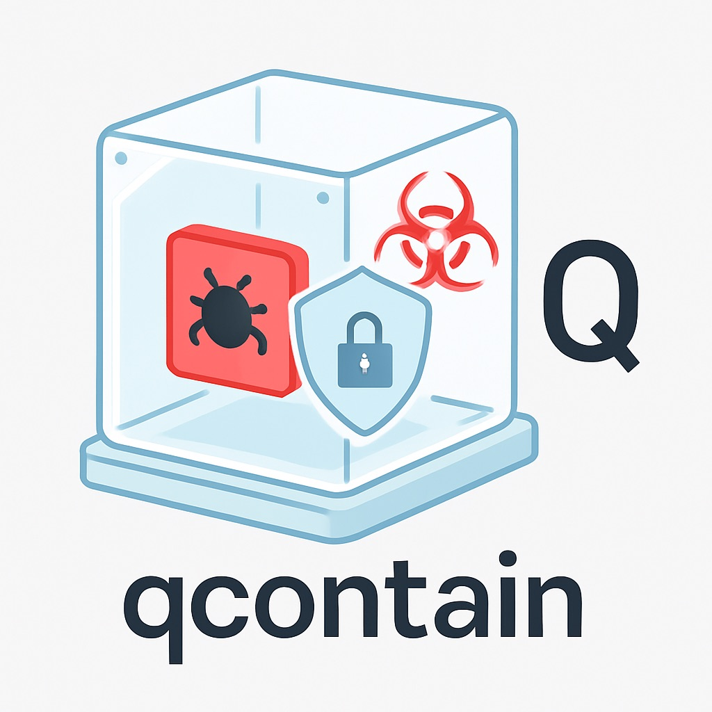

# QContain - automatically encrypt malware quarantine folder files

<p align="center">
  
</p>

**QContain encrypts files in Trend Micro Server Protect quarantine folder**

## Key Features:
1. Automatically encrypts files in Trend Micro Server Protect quarantine folder.
2. Decryption can be performed using any ZIP utility (see known issues).
3. Operates automatically in the background as Windows service.

## Installation

1. Download QContain distributive from  [releases](https://github.com/mpkondrashin/qcontain/releases/latest).
2. Unpack ZIP archive.
3. Run following command (as administrator):
```commandline
qcontain.exe
```
4. Follow setup instructions.
5. It will install QContain service to ```C:\Program Files\QContain```  folder, generate configuration file and start the service.

## Configuration

Configuration file is ```C:\Program Files\QContain\config.yaml```

Example:
```yaml
logging:
  level: info # available values: debug, info, warn, error
  file: qcontain.log # use absolute path to put log file outside installation folder
  max_size: 10 # maximum size of log file in MB
  max_age: 7 # maximum age of log file in days
  max_backups: 3 # maximum number of log files to keep
  compress: true # compress log files
monitor:
  folder: C:\Program Files\Trend\SProtect\x64\Virus # Server Protect Quarantine folder. Change it if you have different installation path
target:
  folder: Quarantine # Target folder to store encrypted files. Use absolute path to put files outside installation folder
  password: virus # Password to encrypt files
  encryption: 1 # Encryption algorithm to use. Available values: 1 (Standard ZIP Encryption), 2 (AES128), 3 (AES192), 4 (AES256)
```

To change configuration edit ```C:\Program Files\QContain\config.yaml``` file and restart QContain service.

## System Requirements

- OS: Windows
- CPU: x86_64
- HDD: 5MB of free space on disk C:

## Uninstall

1. Run following command (as administrator):
```commandline
qcontain.exe stop
```
2. Run following command (as administrator):
```commandline
qcontain.exe uninstall
```
3. Delete ```C:\Program Files\QContain``` folder.

## Known Issues

### Encryption algorithms
Encryption algorithms 2, 3, and 4 are not supported by all ZIP utilities.

### Password security
Encryption passsword is stored in plain text in configuration file.

### Restore from the quarantine
Restore from the quarantine of the Trend Micro Server Protect will not work.

To restore file from the quarantine, you need to decrypt it to folder excluded from antimalware scanning. Or restored to Server Protect quarantine folder, but after stopping QContain service.
